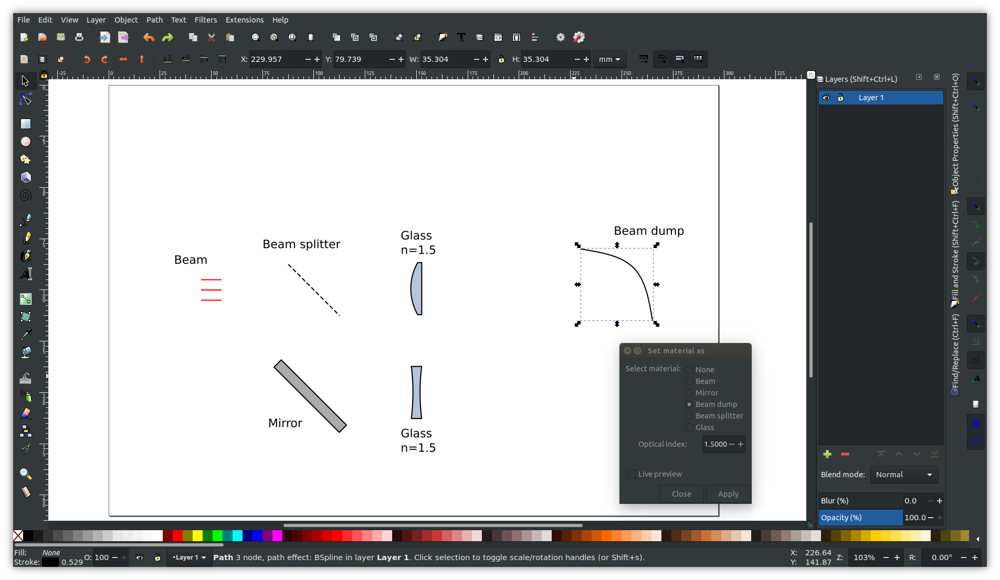

# Inkscape Ray Optics

An extension for Inkscape that makes it easier to draw optical diagrams. 

Allows to annotate Inkscape primitives with optical properties and draws beam paths by taking into account reflection and refraction. 

[Bug reports](https://github.com/damienBloch/inkscape-raytracing/issues) or [suggestions](https://github.com/damienBloch/inkscape-raytracing/discussions) are welcome.

## Examples


|  |
|:--:|
| *Beams through a sphere* |


|  |
|:--:|
| *Microscope alignment* |

## How to install 

Copy the extension directory in Inkscape extensions directory. 

Inkscape extensions directory can be found with Edit/Preferences/System/User extensions

Typically for Linux users:
  ```shell
  cd ~/.config/inkscape/extensions
  git clone https://github.com/damienBloch/inkscape-raytracing
  ```
  
## Requirements
 
Requires [Inkscape1.0](https://inkscape.org/release/inkscape-1.0.2/) or above.
  
In addition, this extension also requires the following programs, but they are usually already installed with Inkscape:
  
   * [Python3.6](https://www.python.org/downloads/) or above
   * [NumPy](https://numpy.org/install/)
   * [Inkex](https://pypi.org/project/inkex/) 
  

## How to use

### 1. For each optical element or group of elements, select it and choose its material with Extenstions/Optics/Set material as:

The material can be one of the following:

  * `Beam`: source of the ray. Need at least one element with this property to see an effect. Typically the element should be a straight line.
  * `Mirror`: reflects an incoming beam. Element can be a closed or open shape.
  * `Beam dump`: absorbs all incoming beams. Element can be a closed or open shape.
  * `Beam splitter`: for each incoming beam, produces one transmitted beam and one reflected beam. Element can be a closed or open shape, but closed shape will cause the number of beams to increase exponentially.
  * `Glass`: with optical index. Transmits and bends a beam depending on its optical index. **Element must be a closed shape**.

This will automatically write some text in the element description. This text is used to reccord the properties of the elements. It is also possible to directly write the text in the description.


  
An element can have at most one optical property and will be ignored if it has two or more.

It is possible to add complementary text in the description. If it doesn't have the syntax `optics:<something>`, the extra text will simply be ignored.


### 2. Select the elements to render and run the extension:


### 3. This will trace all the beams originated from an `optics:beam` element:


Note that the borders of the document blocks the beams and all objects outside the document page will be ignored.


## Known limitations

* Cannot write the properties in a group description. They must be written in the primitives description. 
* Avoid overlapping or touching elements. It won't cause Inkscape to crash, but might give unexpected results.
* The same goes for self-intersecting paths.
* Text elements are ignored whatever their description. If they need to be considered, they must be converted to path first.
* It is possible to use cloned object (Edit/Clone) that mirror all changes applied to the original. In this case the description is inferred from the original description and the clone description is ignored. 
